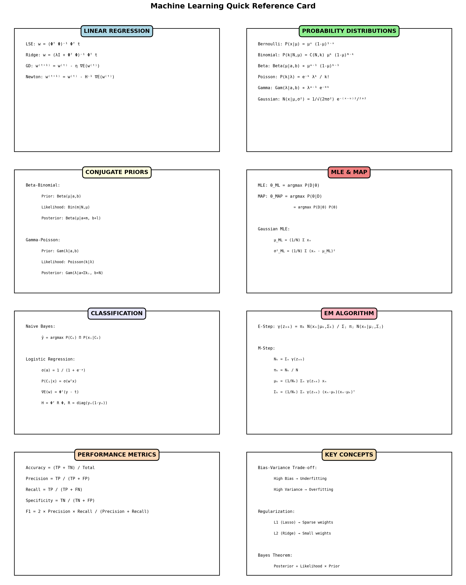

# 📘 Help My Midterm - 機器學習期中考筆記

完整的機器學習核心概念筆記，每章配合豐富的 Python 視覺化幫助你從零開始理解所有內容！

## 🎯 專案簡介

這個專案提供：
- 📝 分章節的機器學習核心概念筆記（中文）
- 📊 17 張高品質視覺化圖片，展示代數和幾何意義
- 🐍 使用 Python 和 uv 管理所有依賴
- 🎨 所有學習輔助圖片都包含在倉庫中

## 📚 內容涵蓋

### [第一章：回歸分析](notes/01-regression.md)
- Least Squares Error (LSE)
- L1/L2 正規化 (Lasso/Ridge)
- 梯度下降 (Gradient Descent)
- 牛頓法 (Newton's Method)
- Bias-Variance Trade-off

### [第二章：機率與分佈](notes/02-probability.md)
- Bayes' Theorem
- MLE & MAP
- Gaussian Distribution
- Beta-Binomial 共軛
- Gamma-Poisson 共軛

### [第三章：分類方法](notes/03-classification.md)
- Naive Bayes Classifier
- Sigmoid Function
- Logistic Regression
- Confusion Matrix 和性能指標

### [第四章：EM 演算法與聚類](notes/04-em-algorithm.md)
- EM Algorithm 原理
- Gaussian Mixture Model (GMM)
- E-step & M-step
- K-Means vs GMM

## 🚀 快速開始

### 1. 閱讀筆記

從 [notes/](notes/) 目錄開始，按章節順序學習：
1. [第一章：回歸分析](notes/01-regression.md)
2. [第二章：機率與分佈](notes/02-probability.md)
3. [第三章：分類方法](notes/03-classification.md)
4. [第四章：EM 演算法與聚類](notes/04-em-algorithm.md)

每個章節都包含：
- 概念解釋（代數角度）
- 視覺化圖片（幾何角度）
- 公式總結
- 練習建議

### 2. 查看視覺化

所有視覺化圖片都在 `output/images/` 目錄：
- 17 張高品質 PNG 圖片
- 展示代數和幾何兩個角度
- 配合筆記內容理解

### 3. 重新生成視覺化（可選）

如果需要修改或重新生成視覺化：

```bash
# 安裝依賴
uv sync

# 生成所有視覺化
uv run python main.py

# 或單獨生成特定章節
uv run python visualizations/regression.py
uv run python visualizations/distributions.py
uv run python visualizations/classification.py
uv run python visualizations/em_algorithm.py
```

## 📂 專案結構

```
help-my-midterm/
├── notes/                   # 分章節筆記
│   ├── README.md           # 筆記導覽
│   ├── 01-regression.md    # 第一章：回歸分析
│   ├── 02-probability.md   # 第二章：機率與分佈
│   ├── 03-classification.md # 第三章：分類方法
│   └── 04-em-algorithm.md  # 第四章：EM 演算法
├── output/images/          # 所有視覺化圖片（17 張）
│   ├── 00_quick_reference.png
│   ├── 01_lse.png
│   └── ...
├── visualizations/         # 視覺化腳本
│   ├── regression.py
│   ├── distributions.py
│   ├── classification.py
│   ├── em_algorithm.py
│   └── quick_reference.py
├── main.py                 # 主程式
├── README.md               # 本文件
└── pyproject.toml          # uv 專案配置
```

## 📊 視覺化圖片

### 快速參考


### 回歸分析（5 張）
- LSE 的幾何意義
- L2 正規化效果
- 梯度下降路徑
- Bias-Variance 權衡
- Newton vs GD 比較

### 機率分佈（4 張）
- 高斯分佈性質
- Beta-Binomial 共軛
- Gamma-Poisson 共軛
- 所有分佈總覽

### 分類方法（4 張）
- Sigmoid 函數
- Logistic Regression 決策邊界
- Naive Bayes 分類
- Confusion Matrix 和指標

### EM 演算法（3 張）
- GMM 聚類結果
- EM 迭代過程
- EM 概念圖

## 💡 學習建議

### 代數與幾何結合
每個概念都從兩個角度理解：
- **代數**：查看筆記中的公式和推導
- **幾何**：觀察對應的視覺化圖片

### 視覺化記憶法
- 看到公式時，回想對應的圖片
- 例如：LSE → 誤差線圖
- 例如：Gradient Descent → 等高線路徑

### 按順序學習
1. 先讀概念解釋
2. 查看視覺化圖片
3. 理解公式推導
4. 嘗試練習建議

## 🔧 依賴套件

- Python >= 3.12
- numpy - 數值計算
- matplotlib - 繪圖
- scipy - 科學計算
- scikit-learn - 機器學習工具
- seaborn - 統計視覺化

所有依賴透過 `uv` 管理，確保可重現性。

## 📝 授權

此專案為教育用途，歡迎自由使用和分享。

---

**祝你期中考試順利！ 📚✨**

記住：每個概念都有代數和幾何兩個角度，配合視覺化學習效果最佳！
