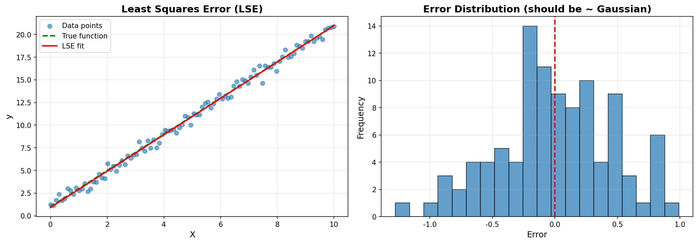
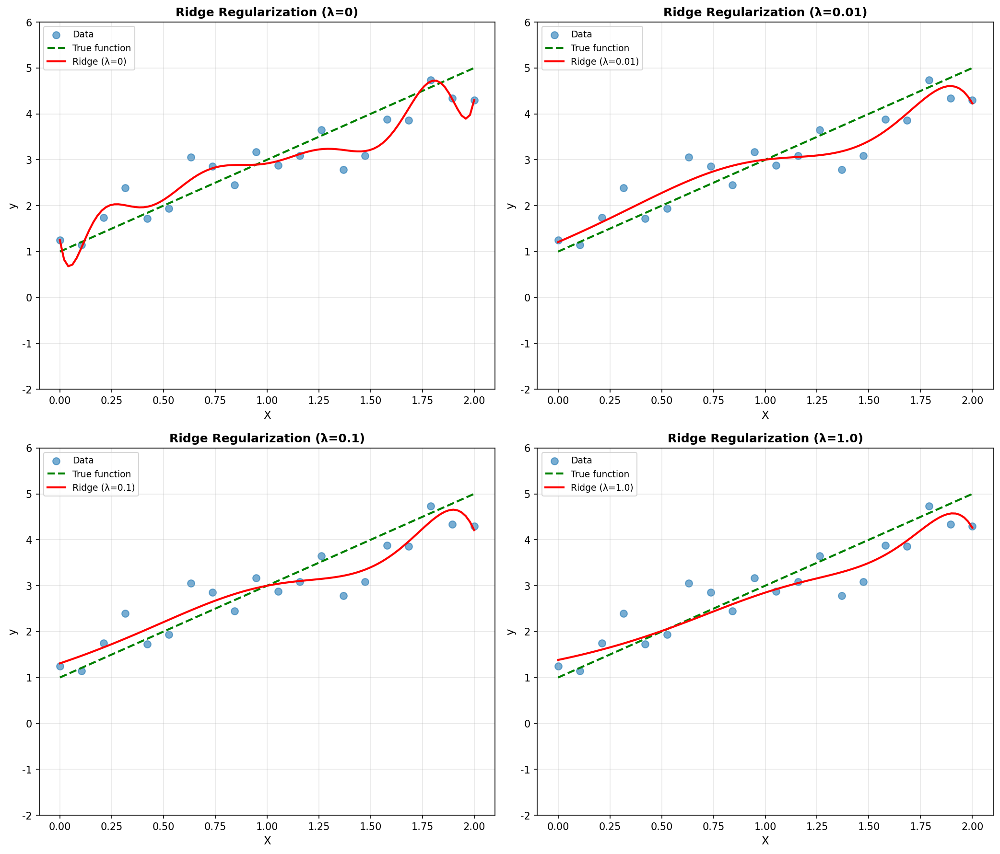
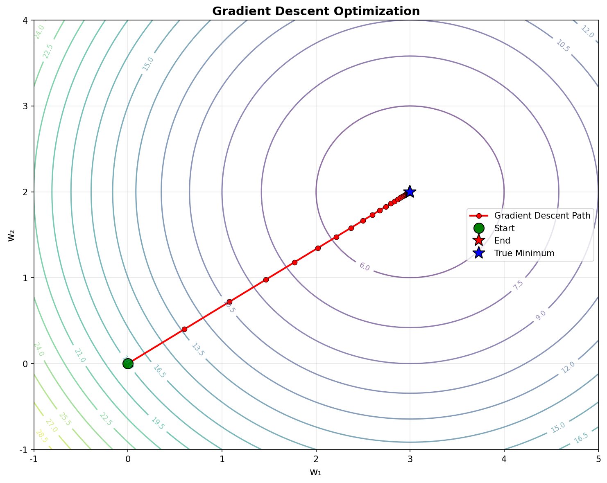
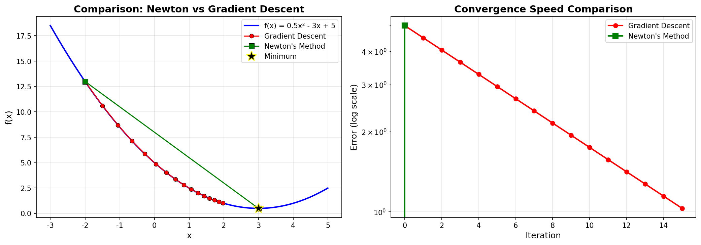
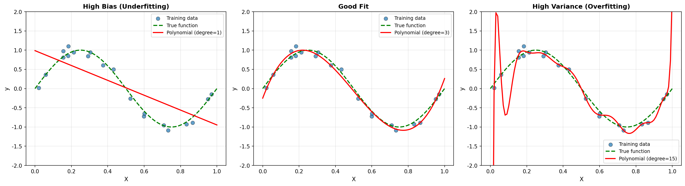

# 第一章：回歸分析 (Regression Analysis)

回歸分析是機器學習的基礎，用於預測連續值輸出。本章涵蓋最小平方誤差、正規化、梯度下降等核心概念。

---

## 1. Least Squares Error (LSE)

### 概念理解

**為何合理**：假設誤差服從高斯分佈（Gaussian Distribution）

**目標**：最小化預測值與真實值之間的平方差總和

**數學表示**：
$$E_D(w) = \frac{1}{2}\sum_{n=1}^{N} (y_n - w^T\phi(x_n))^2$$

**直觀理解**：
LSE 就像在找一條最能代表數據趨勢的線。每個點到線的距離的平方加起來最小的那條線就是我們要的。

### 解析解

對於線性回歸，LSE 有閉式解：

$$w_{LSE} = (\Phi^T\Phi)^{-1}\Phi^T t$$

其中：
- $\Phi$ 是設計矩陣（design matrix）
- $t$ 是目標值向量

### 視覺化

**圖片說明**：
- **左圖**：展示數據點、真實函數和 LSE 擬合線，以及部分誤差線
- **右圖**：誤差分佈應接近高斯分佈（假設的基礎）

---

## 2. Regularization（正規化）

正規化是防止模型過度擬合的技術。

### L2 Regularization (Ridge)

**目的**：使權重 $w$ 變小但不為零

**公式**：
$$E(w) = E_D(w) + \frac{\lambda}{2} w^T w$$

**解析解**：
$$w_{Ridge} = (\lambda I + \Phi^T\Phi)^{-1}\Phi^T t$$

**效果**：讓模型更平滑，減少對訓練數據的過度依賴

### L1 Regularization (Lasso)

**目的**：使權重稀疏（許多權重變成 0）

**公式**：
$$E(w) = E_D(w) + \frac{\lambda}{2}|w|$$

**效果**：自動進行特徵選擇

### 為什麼需要正規化？

想像你在記憶一組數字。如果你記住每個數字的每個細節（過度擬合），遇到新的相似數字時反而會搞混。正規化就是教你抓住重點而不是死記硬背。

### 視覺化

**圖片說明**：展示不同 $\lambda$ 值對擬合結果的影響
- $\lambda = 0$：無正規化，可能過度擬合
- $\lambda = 0.01, 0.1, 1.0$：隨著 $\lambda$ 增加，模型變得更平滑

---

## 3. Gradient Descent (梯度下降)

### 概念

**核心思想**：沿著梯度最陡峭的相反方向更新參數

**更新規則**：
$$w^{(t+1)} = w^{(t)} - \eta \nabla E(w^{(t)})$$

其中：
- $\eta$ 是學習率（learning rate），控制每次更新的步長
- $\nabla E(w^{(t)})$ 是損失函數在當前點的梯度

### 登山比喻

梯度下降就像在濃霧中下山。你看不到山底在哪，但可以感覺到哪個方向最陡。每次都往最陡的方向走一小步，最終會到達山底（最小值）。

### 學習率的影響

- **太大**：可能跳過最小值，無法收斂
- **太小**：收斂太慢
- **適中**：穩定且有效率地收斂

### 視覺化

**圖片說明**：
- 等高線圖顯示損失函數的形狀
- 紅色路徑顯示梯度下降的收斂過程
- 從起點（綠點）逐步接近最小值（藍星）

---

## 4. Newton's Method（牛頓法）

### 概念

**特點**：使用二階導數（Hessian 矩陣）加速收斂

**更新規則**：
$$w^{(t+1)} = w^{(t)} - H^{-1}\nabla E(w^{(t)})$$

其中 Hessian 矩陣：
$$H = \nabla\nabla E(w) = \Phi^T\Phi \quad \text{(for LSE)}$$

### 優缺點

**優點**：
- 收斂速度快（二次收斂）
- 接近最小值時更有效率

**缺點**：
- 計算 Hessian 矩陣和其逆矩陣成本高
- 若 Hessian 奇異（singular），應改用梯度下降

### 視覺化

**圖片說明**：
- **左圖**：展示兩種方法的收斂路徑
  - 紅色：梯度下降（需要更多迭代）
  - 綠色：牛頓法（收斂更快）
- **右圖**：收斂速度比較（對數尺度）
  - 牛頓法的誤差下降更快

---

## 5. Bias–Variance Trade-off（偏差-變異權衡）

這是機器學習中最重要的概念之一。

### 高偏差（High Bias）

**特徵**：
- 模型太簡單
- 無法捕捉數據的真實模式
- 結果：欠擬合（Underfitting）

**例子**：用直線擬合曲線數據

### 高變異（High Variance）

**特徵**：
- 模型太複雜
- 對訓練數據過度敏感
- 結果：過度擬合（Overfitting）

**例子**：用高次多項式擬合少量數據點

### 射箭比喻

- **高偏差**：箭都偏離靶心，但很集中 → 瞄準有問題
- **高變異**：箭分散在靶子各處 → 不穩定
- **理想狀態**：箭都集中在靶心附近

### 數學表示

期望預測誤差可分解為：
$$\text{Expected Error} = \text{Bias}^2 + \text{Variance} + \text{Irreducible Error}$$

### 視覺化

**圖片說明**：展示三種模型複雜度的影響
- **左圖（高偏差）**：一次多項式，欠擬合
- **中圖（良好平衡）**：三次多項式，恰到好處
- **右圖（高變異）**：十五次多項式，過度擬合

---

## 公式總結

### Linear Regression

**模型**：
$$y(x, w) = w^T \phi(x)$$

**損失函數**：
- **LSE**: $E_D(w) = \frac{1}{2}\sum_{n=1}^{N} (y_n - w^T\phi(x_n))^2$
- **Ridge (L2)**: $E(w) = E_D(w) + \frac{\lambda}{2} w^T w$
- **Lasso (L1)**: $E(w) = E_D(w) + \frac{\lambda}{2}|w|$

**解析解**：
- **LSE**: $w_{LSE} = (\Phi^T\Phi)^{-1}\Phi^T t$
- **Ridge**: $w_{Ridge} = (\lambda I + \Phi^T\Phi)^{-1}\Phi^T t$

**優化方法**：
- **GD**: $w^{(t+1)} = w^{(t)} - \eta \nabla E(w^{(t)})$
- **Newton**: $w^{(t+1)} = w^{(t)} - H^{-1}\nabla E(w^{(t)})$

---

## 重要觀念

1. **LSE 的假設**：誤差服從高斯分佈
2. **正規化的目的**：防止過度擬合
3. **學習率的選擇**：影響梯度下降的收斂速度和穩定性
4. **Hessian 矩陣**：包含二階導數信息，加速收斂
5. **模型複雜度**：需要在 bias 和 variance 之間取得平衡

---

## 練習建議

1. **親手推導** LSE 的解析解
2. **理解** L1 和 L2 正規化的幾何意義
3. **實現** 梯度下降算法
4. **觀察** 不同學習率對收斂的影響
5. **比較** 不同模型複雜度的擬合效果
