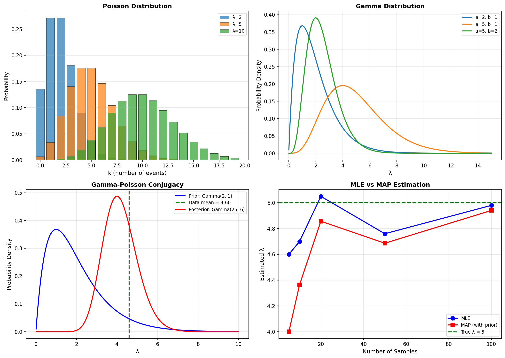
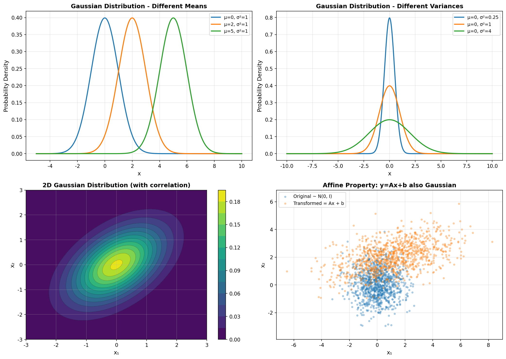
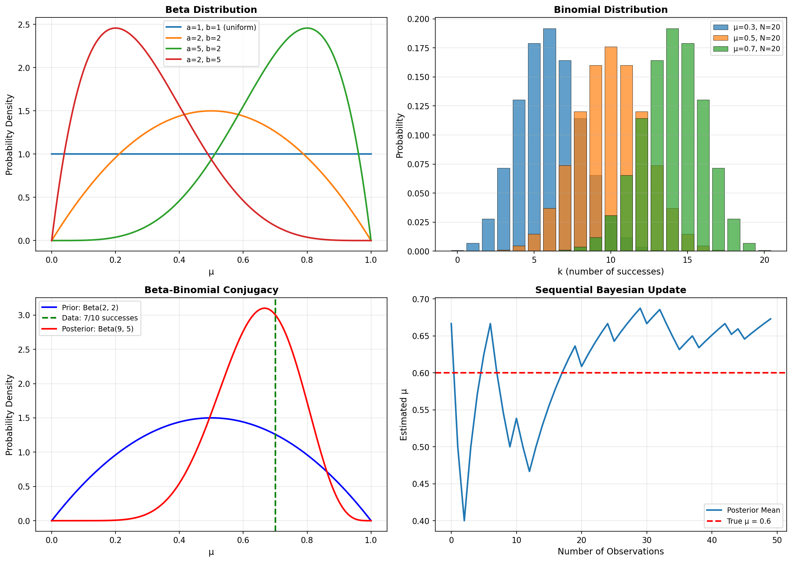
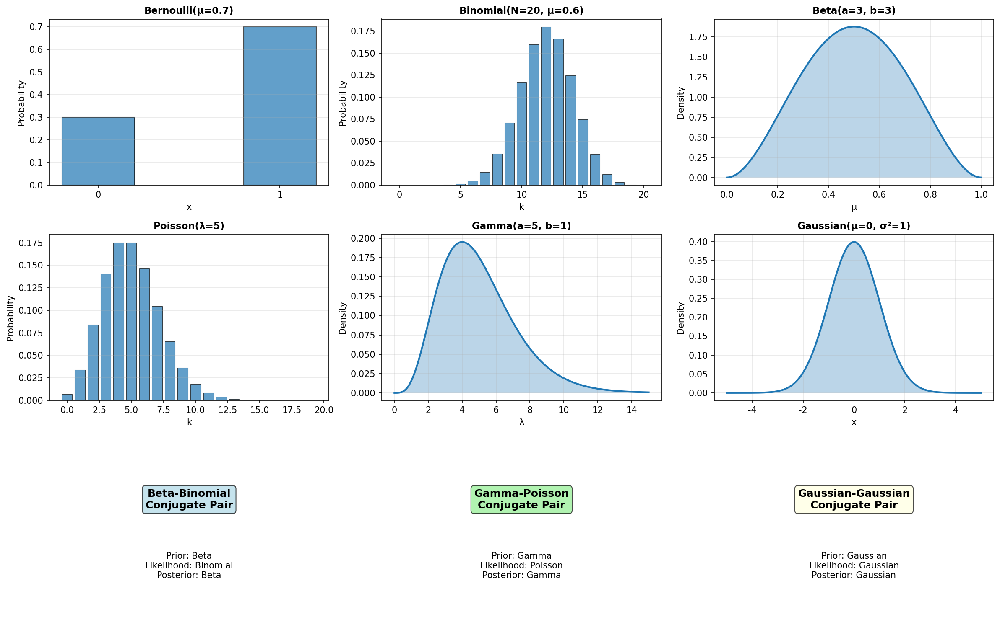

# 第二章：機率與分佈 (Probability & Distributions)

機率理論是機器學習的數學基礎。本章涵蓋貝葉斯定理、各種機率分佈、MLE 和 MAP 等核心概念。

---

## 1. Bayes' Theorem（貝葉斯定理）

### 數學表示

$$P(\theta|D) = \frac{P(D|\theta)P(\theta)}{P(D)}$$

或簡寫為：
$$\text{Posterior} \propto \text{Likelihood} \times \text{Prior}$$

### 直觀理解

- **Prior（先驗）**：在看到數據之前，我們對參數的信念
- **Likelihood（似然）**：給定參數，觀察到這些數據的可能性
- **Posterior（後驗）**：看到數據後，更新的信念

### 醫療診斷例子

**情境**：
- Prior: 這個疾病的發病率是 1%
- Likelihood: 如果有病，測試陽性的機率是 99%
- Question: 測試陽性後，真的有病的機率是多少？

**計算**：
```
P(病|陽性) = P(陽性|病) × P(病) / P(陽性)
         = 0.99 × 0.01 / P(陽性)
```

這個例子說明了為什麼需要考慮 prior 機率。

---

## 2. Maximum Likelihood Estimation (MLE)

### 概念

**目標**：找到參數 $\theta$ 使觀測資料機率 $P(D|\theta)$ 最大

**步驟**：
1. 寫出似然函數 $L(\theta) = P(D|\theta)$
2. 取對數得到 log-likelihood $\log L(\theta)$
3. 對 $\theta$ 求導並令其為零
4. 解出 $\theta_{MLE}$

**數學表示**：
$$\theta_{ML} = \arg\max_\theta P(D|\theta) = \arg\max_\theta \log P(D|\theta)$$

### 高斯分佈的 MLE

對於高斯分佈 $N(\mu, \sigma^2)$：

$$\mu_{ML} = \frac{1}{N}\sum_{n=1}^{N} x_n$$

$$\sigma_{ML}^2 = \frac{1}{N}\sum_{n=1}^{N}(x_n - \mu_{ML})^2$$

### Poisson 分佈的 MLE

對於 Poisson 分佈 $P(k|\lambda)$：

$$\lambda_{MLE} = \frac{1}{N}\sum_{n=1}^{N} k_n$$

---

## 3. Maximum A Posteriori (MAP)

### 與 MLE 的不同

**MAP** 引入先驗分佈 $P(\theta)$

**目標**：最大化 $P(\theta|D) \propto P(D|\theta)P(\theta)$

**數學表示**：
$$\theta_{MAP} = \arg\max_\theta P(\theta|D) = \arg\max_\theta P(D|\theta)P(\theta)$$

### MLE vs MAP

| 特性 | MLE | MAP |
|------|-----|-----|
| 考慮先驗 | ✗ | ✓ |
| 完全根據數據 | ✓ | ✗ |
| 可融入知識 | ✗ | ✓ |
| 當先驗均勻時 | - | = MLE |

### 視覺化



**圖片說明**：右下圖展示 MLE 和 MAP 估計的差異
- 藍點：MLE 估計
- 紅點：MAP 估計（考慮先驗）
- 隨著樣本增加，兩者逐漸接近

---

## 4. Gaussian Distribution（高斯分佈）

### 一維高斯分佈

**機率密度函數**：
$$N(x|\mu,\sigma^2) = \frac{1}{\sqrt{2\pi\sigma^2}}e^{-\frac{(x-\mu)^2}{2\sigma^2}}$$

**參數**：
- $\mu$：均值（mean），決定分佈中心
- $\sigma^2$：變異數（variance），決定分佈寬度

### 多維高斯分佈

**機率密度函數**：
$$N(x|\mu,\Sigma) = \frac{1}{(2\pi)^{D/2}|\Sigma|^{1/2}}e^{-\frac{1}{2}(x-\mu)^T\Sigma^{-1}(x-\mu)}$$

**參數**：
- $\mu$：均值向量
- $\Sigma$：共變異數矩陣（covariance matrix）

### 重要性質

#### 1. Isotropic Gaussian（各向同性）

**定義**：共變異數矩陣 $\Sigma = \sigma^2 I$（對角且值相同）

**特性**：各維度獨立且有相同的變異數

#### 2. Affine Property（仿射性質）

**定理**：若 $x \sim N(\mu, \Sigma)$ 且 $y = Ax + b$

則 $y \sim N(A\mu + b, A\Sigma A^T)$

**意義**：高斯分佈經過線性轉換後仍是高斯分佈

### 視覺化



**圖片說明**：
- **左上**：不同均值的一維高斯分佈
- **右上**：不同變異數的一維高斯分佈
- **左下**：二維高斯分佈的等高線圖（有相關性）
- **右下**：Affine 性質示範（線性轉換後仍是高斯）

---

## 5. Conjugate Prior（共軛先驗）

### 定義

當先驗和似然結合後，後驗仍與先驗具有相同的分佈形式。

### 為什麼有用？

共軛先驗讓貝葉斯推斷變得簡單。每次看到新數據，只需要更新參數，不需要重新計算複雜的積分。

---

## 6. Beta–Binomial 共軛對

### 分佈定義

**Beta 分佈**：
$$\text{Beta}(\mu|a,b) = \frac{\Gamma(a+b)}{\Gamma(a)\Gamma(b)}\mu^{a-1}(1-\mu)^{b-1}$$

**Binomial 分佈**：
$$\text{Bin}(k|N,\mu) = \binom{N}{k}\mu^k(1-\mu)^{N-k}$$

### 共軛關係

- **Prior**: $\text{Beta}(\mu|a,b)$
- **Likelihood**: $\text{Bin}(m|N,\mu)$（m 次成功，N 次試驗）
- **Posterior**: $\text{Beta}(\mu|a+m, b+l)$ 其中 $l = N-m$

### Sequential Update（序列更新）

每觀察一次新數據：
- 如果成功：$a \leftarrow a + 1$
- 如果失敗：$b \leftarrow b + 1$

後驗均值逐漸接近真實值。

### 視覺化



**圖片說明**：
- **左上**：不同參數的 Beta 分佈
- **右上**：不同參數的 Binomial 分佈
- **左下**：共軛更新示範（Prior → Posterior）
- **右下**：Sequential Update（後驗均值逐漸收斂到真實值）

---

## 7. Gamma–Poisson 共軛對

### 分佈定義

**Poisson 分佈**：
$$P(k|\lambda) = e^{-\lambda}\frac{\lambda^k}{k!}$$

**Gamma 分佈**：
$$\text{Gam}(\lambda|a,b) \propto \lambda^{a-1}e^{-b\lambda}$$

### 共軛關係

- **Prior**: $\text{Gam}(\lambda|a,b)$
- **Likelihood**: $\prod_{n=1}^{N} \text{Poisson}(k_n|\lambda)$
- **Posterior**: $\text{Gam}(\lambda|a+\sum k_i, b+N)$

### 視覺化


**圖片說明**：
- **左上**：不同參數的 Poisson 分佈
- **右上**：不同參數的 Gamma 分佈
- **左下**：共軛更新示範
- **右下**：MLE vs MAP 估計比較

---

## 8. 所有分佈總覽

### 離散分佈

1. **Bernoulli（伯努利）**：
   $$\text{Bern}(x|\mu) = \mu^x (1-\mu)^{1-x}$$
   - 單次試驗，成功機率 $\mu$

2. **Binomial（二項式）**：
   $$\text{Bin}(k|N,\mu) = \binom{N}{k}\mu^k(1-\mu)^{N-k}$$
   - N 次獨立試驗，k 次成功

3. **Poisson（泊松）**：
   $$P(k|\lambda) = e^{-\lambda}\frac{\lambda^k}{k!}$$
   - 單位時間內事件發生 k 次的機率

### 連續分佈

1. **Beta（貝塔）**：
   $$\text{Beta}(\mu|a,b) = \frac{\Gamma(a+b)}{\Gamma(a)\Gamma(b)}\mu^{a-1}(1-\mu)^{b-1}$$
   - 定義在 [0,1]，是 Binomial 的共軛先驗

2. **Gamma（伽瑪）**：
   $$\text{Gam}(\lambda|a,b) \propto \lambda^{a-1}e^{-b\lambda}$$
   - 定義在 $(0,\infty)$，是 Poisson 的共軛先驗

3. **Gaussian（高斯）**：
   - 1D: $N(x|\mu,\sigma^2) = \frac{1}{\sqrt{2\pi\sigma^2}}e^{-\frac{(x-\mu)^2}{2\sigma^2}}$
   - Multi-D: $N(x|\mu,\Sigma) = \frac{1}{(2\pi)^{D/2}|\Sigma|^{1/2}}e^{-\frac{1}{2}(x-\mu)^T\Sigma^{-1}(x-\mu)}$

### 視覺化



**圖片說明**：展示所有重要機率分佈的形狀和共軛關係

---

## 公式總結

### MLE & MAP

**MLE**：
$$\theta_{ML} = \arg\max_\theta P(D|\theta)$$

**MAP**：
$$\theta_{MAP} = \arg\max_\theta P(D|\theta)P(\theta)$$

### 共軛關係

**Beta–Binomial**：
- Prior: $\text{Beta}(\mu|a,b)$
- Likelihood: $\text{Bin}(m|N,\mu)$
- Posterior: $\text{Beta}(\mu|a+m, b+l)$ where $l=N-m$

**Gamma–Poisson**：
- Prior: $\text{Gam}(\lambda|a,b)$
- Likelihood: $\prod_{n=1}^{N} \text{Poisson}(k_n|\lambda)$
- Posterior: $\text{Gam}(\lambda|a+\sum k_i, b+N)$

**Gaussian–Gaussian**：
- Prior: $N(w|m_0, S_0)$
- Likelihood: $N(t|\Phi w, \beta^{-1}I)$
- Posterior: $N(w|m_N, S_N)$

---

## 重要觀念

1. **貝葉斯定理**：連結 prior、likelihood 和 posterior
2. **MLE**：完全根據數據估計參數
3. **MAP**：結合數據和先驗知識
4. **共軛先驗**：簡化貝葉斯推斷
5. **高斯分佈**：機器學習中最重要的分佈
6. **Affine 性質**：線性轉換保持高斯性

---

## 練習建議

1. **推導** 高斯分佈的 MLE
2. **證明** Beta-Binomial 共軛關係
3. **理解** 為什麼 MAP = MLE + L2 正規化
4. **實現** Sequential Bayesian Update
5. **觀察** 樣本數對 MLE 和 MAP 估計的影響
