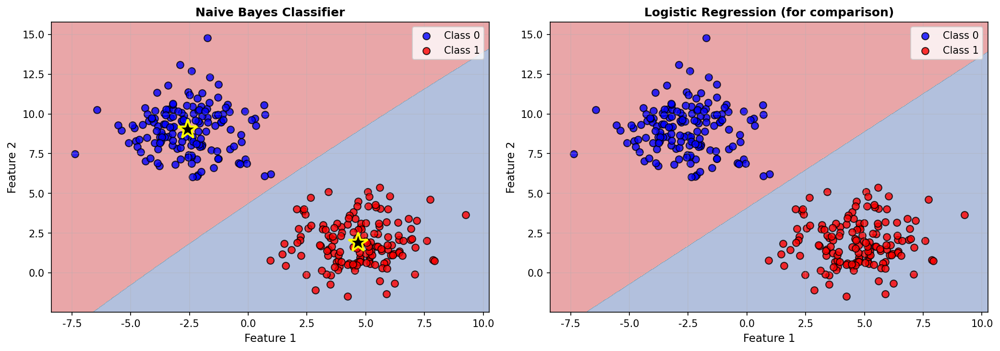
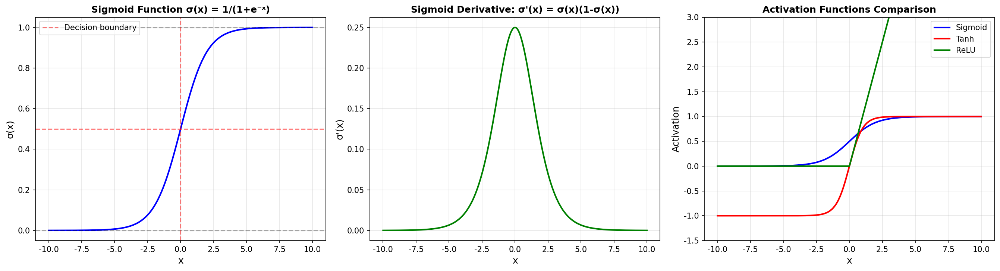
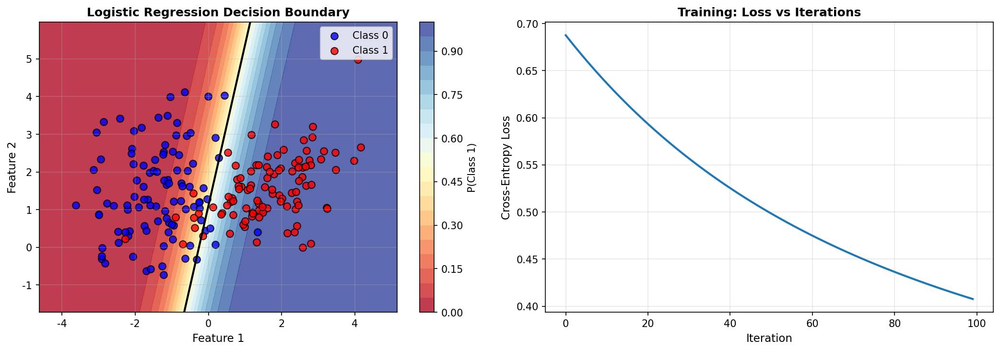
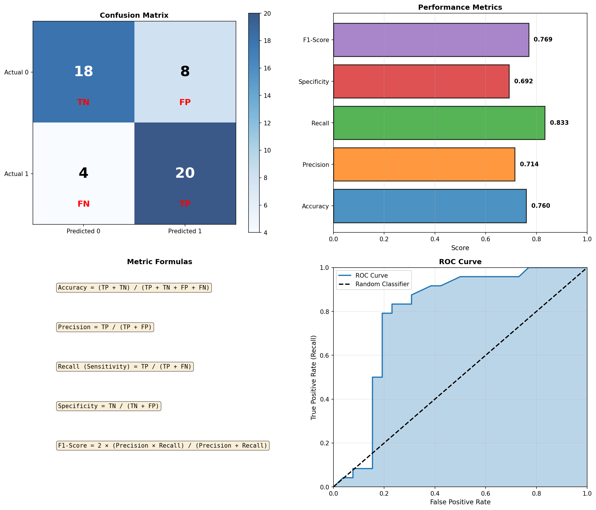

# 第三章：分類方法 (Classification Methods)

分類是機器學習中的重要任務，用於預測離散類別。本章涵蓋 Naive Bayes、Logistic Regression 和性能評估等核心概念。

---

## 1. Naive Bayes Classifier（樸素貝葉斯分類器）

### 核心假設

**條件獨立**：各特徵在給定類別下條件獨立

### 分類規則

$$\hat{y} = \arg\max_k P(C_k) \prod_{i=1}^{D} P(x_i|C_k)$$

### 為什麼叫「樸素」？

因為假設特徵之間完全獨立，這個假設很「樸素」（通常不成立），但實際效果卻很好。

### 處理不同類型特徵

#### 1. 離散特徵（Laplace Smoothing）

$$P(x_i=j|C_k) = \frac{\text{Count}(x_i=j \text{ in } C_k) + 1}{\text{Count}(C_k) + \text{TotalBins}}$$

**為什麼加 1？** 避免零機率問題

#### 2. 連續特徵（Gaussian Assumption）

$$P(x_i|C_k) = N(x_i|\mu_{ik}, \sigma_{ik}^2)$$

假設每個特徵在每個類別下服從高斯分佈

### 訓練步驟

1. **計算 Prior**：$P(C_k) = \frac{N_k}{N}$
2. **計算 Likelihood**：對每個特徵，計算 $P(x_i|C_k)$
3. **預測**：使用貝葉斯規則選擇最可能的類別

### 視覺化

**圖片說明**：
- **左圖**：Naive Bayes 的決策邊界
  - 黑色星星標記高斯分佈中心
  - 顯示了假設特徵獨立的分類效果
- **右圖**：Logistic Regression 的決策邊界（比較）
  - 展示不同方法的差異

---

## 2. Sigmoid Function（Sigmoid 函數）

### 定義

$$\sigma(a) = \frac{1}{1+e^{-a}}$$

### 重要性質

1. **輸出範圍**：$(0, 1)$ — 可解釋為機率
2. **對稱性**：$\sigma(-a) = 1 - \sigma(a)$
3. **導數**：$\frac{d\sigma}{da} = \sigma(a)(1-\sigma(a))$

### 為什麼用 Sigmoid？

1. 輸出範圍在 [0,1]，可解釋為機率
2. 可微分，方便梯度下降
3. 有良好的數學性質

### 視覺化

**圖片說明**：
- **左圖**：Sigmoid 函數形狀
  - 在 x=0 處值為 0.5（決策邊界）
  - S 型曲線平滑轉換
- **中圖**：Sigmoid 導數
  - 在 x=0 處導數最大
  - 兩端導數接近 0（梯度消失問題的來源）
- **右圖**：與其他激活函數比較
  - Sigmoid vs Tanh vs ReLU

---

## 3. Logistic Regression（邏輯回歸）

### 名字的誤導

雖然叫「回歸」，實際上是**分類**模型！

### 模型定義

**二分類**：
$$P(C_1|\phi) = \sigma(w^T\phi) = \frac{1}{1+e^{-w^T\phi}}$$

其中 $\phi(x)$ 是特徵向量（可能包含非線性轉換）

### 損失函數（Cross-Entropy）

$$E(w) = -\sum_{n=1}^{N}[t_n\ln y_n + (1-t_n)\ln(1-y_n)]$$

其中：
- $t_n \in \{0, 1\}$ 是真實標籤
- $y_n = \sigma(w^T\phi_n)$ 是預測機率

### 訓練方法

#### 1. Gradient Descent

**梯度**：
$$\nabla E(w) = \sum_{n=1}^{N}(y_n - t_n)\phi_n = \Phi^T(y - t)$$

**更新規則**：
$$w^{(t+1)} = w^{(t)} - \eta \Phi^T(y - t)$$

#### 2. Newton's Method / IRLS

**Hessian**：
$$H = \nabla\nabla E(w) = \Phi^T R \Phi$$

其中 $R = \text{diag}(y_n(1-y_n))$

**更新規則**：
$$w^{(new)} = w^{(old)} - H^{-1}\nabla E(w^{(old)})$$

### 決策邊界

決策邊界是 $P(C_1|x) = 0.5$ 的等高線，即：
$$w^T\phi(x) = 0$$

這是特徵空間中的一個**線性**邊界（若 $\phi(x) = x$）

### 視覺化

**圖片說明**：
- **左圖**：決策邊界和機率等高線
  - 顏色表示 P(Class 1)
  - 黑色線是決策邊界（P = 0.5）
- **右圖**：訓練過程中損失函數的下降
  - 展示 Cross-Entropy Loss 隨迭代次數遞減

---

## 4. Confusion Matrix（混淆矩陣）

### 定義

|           | Predict Positive | Predict Negative |
|-----------|------------------|------------------|
| **Actual Positive** | TP (True Positive)  | FN (False Negative) |
| **Actual Negative** | FP (False Positive) | TN (True Negative)  |

### 重要指標

#### 1. Accuracy（準確率）

$$\text{Accuracy} = \frac{TP + TN}{TP + TN + FP + FN}$$

**意義**：整體正確率

**問題**：類別不平衡時會誤導

#### 2. Precision（精確率）

$$\text{Precision} = \frac{TP}{TP + FP}$$

**意義**：預測為正的樣本中，有多少真的是正

**用途**：當誤判為正的代價高時（如垃圾郵件過濾）

#### 3. Recall / Sensitivity（召回率 / 敏感度）

$$\text{Recall} = \frac{TP}{TP + FN}$$

**意義**：實際為正的樣本中，有多少被正確預測為正

**用途**：當漏掉正樣本的代價高時（如疾病檢測）

#### 4. Specificity（特異度）

$$\text{Specificity} = \frac{TN}{TN + FP}$$

**意義**：實際為負的樣本中，有多少被正確預測為負

**用途**：評估對負樣本的識別能力

#### 5. F1-Score

$$F1 = 2 \times \frac{\text{Precision} \times \text{Recall}}{\text{Precision} + \text{Recall}}$$

**意義**：Precision 和 Recall 的調和平均

**用途**：綜合考慮 Precision 和 Recall

### 醫療檢測例子

**情境**：癌症篩檢

- **高 Sensitivity**：不會漏掉真正的病人（少 False Negative）
- **高 Specificity**：不會誤診健康的人（少 False Positive）

權衡：
- 提高 Sensitivity → 可能降低 Specificity
- 需要根據應用場景選擇

### ROC Curve（接收者操作特徵曲線）

**定義**：不同閾值下 TPR vs FPR 的曲線

- **TPR (True Positive Rate)** = Recall = Sensitivity
- **FPR (False Positive Rate)** = 1 - Specificity

**AUC (Area Under Curve)**：
- 越接近 1 越好
- 0.5 表示隨機猜測

### 視覺化

**圖片說明**：
- **左上**：混淆矩陣
  - 顯示 TP, FP, TN, FN 的數量
- **右上**：性能指標柱狀圖
  - 展示 Accuracy, Precision, Recall, Specificity, F1-Score
- **左下**：指標計算公式
- **右下**：ROC 曲線
  - 藍色曲線：模型的 ROC
  - 黑色虛線：隨機分類器

---

## 公式總結

### Naive Bayes

**一般形式**：
$$\hat{y} = \arg\max_k P(C_k) \prod_{i=1}^{D} P(x_i|C_k)$$

**離散特徵**（Laplace Smoothing）：
$$P(x_i=j|C_k) = \frac{\text{Count}(x_i=j \text{ in } C_k) + 1}{\text{Count}(C_k) + \text{TotalBins}}$$

**連續特徵**（Gaussian Assumption）：
$$P(x_i|C_k) = N(x_i|\mu_{ik}, \sigma_{ik}^2)$$

### Logistic Regression

**Sigmoid Function**：
$$\sigma(a) = \frac{1}{1+e^{-a}}$$

**Model**：
$$y_n = P(C_1|\phi_n) = \sigma(w^T\phi_n)$$

**Cross-Entropy Error**：
$$E(w) = -\sum_{n=1}^{N}[t_n\ln y_n + (1-t_n)\ln(1-y_n)]$$

**Gradient**：
$$\nabla E(w) = \Phi^T(y - t)$$

**Hessian**：
$$H = \Phi^T R \Phi, \quad R = \text{diag}(y_n(1-y_n))$$

### Performance Metrics

- **Accuracy**: $\frac{TP + TN}{Total}$
- **Precision**: $\frac{TP}{TP + FP}$
- **Recall**: $\frac{TP}{TP + FN}$
- **Specificity**: $\frac{TN}{TN + FP}$
- **F1-Score**: $\frac{2 \times Precision \times Recall}{Precision + Recall}$

---

## 重要觀念

1. **Naive Bayes**：簡單但有效的分類器
2. **條件獨立假設**：雖然通常不成立，但實際效果好
3. **Sigmoid 函數**：將實數映射到 (0,1) 區間
4. **Cross-Entropy**：分類問題的標準損失函數
5. **混淆矩陣**：評估分類器性能的基礎
6. **Precision vs Recall**：需要根據應用場景權衡

---

## 練習建議

1. **推導** Logistic Regression 的梯度
2. **理解** 為什麼 Sigmoid 導數有特殊形式
3. **計算** 給定混淆矩陣的所有性能指標
4. **比較** Naive Bayes 和 Logistic Regression 的假設
5. **分析** 不同閾值對 Precision 和 Recall 的影響
