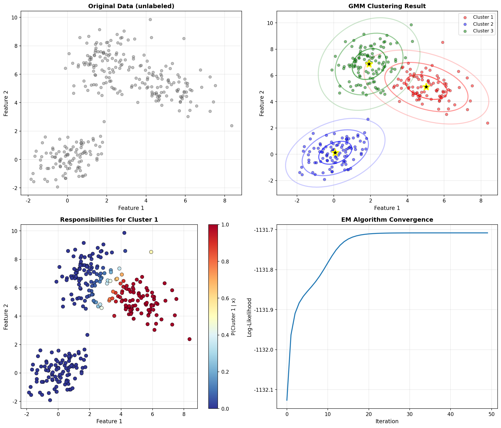
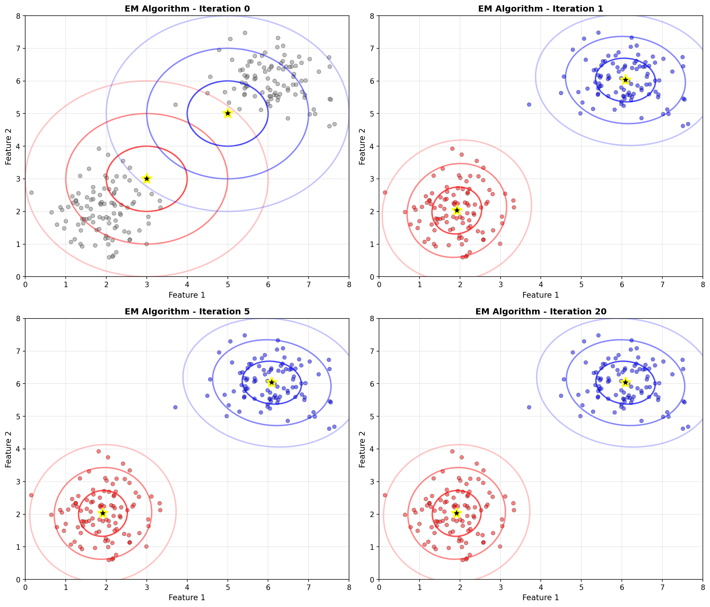

# 第四章：EM 演算法與聚類 (EM Algorithm & Clustering)

EM 演算法是處理潛在變數和缺失數據的強大工具。本章涵蓋 EM 演算法原理和 Gaussian Mixture Model (GMM) 的應用。

---

## 1. EM Algorithm 概述

### 問題設定

當我們有**潛在變數**（latent variables）或**缺失數據**時，直接最大化似然函數 $P(X|\theta)$ 很困難。

**EM 演算法**提供了一個迭代的解決方案。

### 核心思想

交替執行兩個步驟直到收斂：

1. **E-step（期望步驟）**：計算潛在變數的後驗機率
2. **M-step（最大化步驟）**：更新參數以最大化期望對數似然

### 為什麼叫 EM？

- **E-step**: 根據當前參數，**期望**潛在變數是什麼
- **M-step**: 根據期望的潛在變數，**最大化**參數

### 數學表示

**目標**：最大化 $P(X|\theta)$ 當有潛在變數 $Z$ 時

**E-Step**：
$$Q(\theta, \theta^{old}) = \sum_Z P(Z|X,\theta^{old}) \log P(X,Z|\theta)$$

$$\gamma(z_k) = P(Z=k|X, \theta^{old})$$

**M-Step**：
$$\theta^{new} = \arg\max_\theta Q(\theta, \theta^{old})$$

### 收斂性質

**保證**：
- 對數似然 $\log P(X|\theta)$ 在每次迭代中不減少
- 收斂到**局部最大值**

**注意**：
- 結果依賴於初始化
- 可能收斂到不同的局部最大值

---

## 2. Gaussian Mixture Model (GMM)

### 模型定義

GMM 假設數據來自 K 個高斯分佈的混合：

$$P(x) = \sum_{k=1}^{K} \pi_k N(x|\mu_k, \Sigma_k)$$

其中：
- $\pi_k$：混合權重（mixing coefficient），$\sum_k \pi_k = 1$
- $\mu_k$：第 k 個高斯的均值
- $\Sigma_k$：第 k 個高斯的共變異數矩陣

### 潛在變數

引入潛在變數 $z_{nk} \in \{0,1\}$：
- $z_{nk} = 1$ 表示數據點 $x_n$ 屬於第 k 個 cluster
- $\sum_k z_{nk} = 1$（每個點只屬於一個 cluster）

---

## 3. GMM 的 EM 演算法

### E-Step：計算 Responsibilities

**Responsibility** $\gamma(z_{nk})$ 表示數據點 $x_n$ 屬於 cluster k 的後驗機率：

$$\gamma(z_{nk}) = \frac{\pi_k N(x_n|\mu_k,\Sigma_k)}{\sum_{j=1}^{K}\pi_j N(x_n|\mu_j,\Sigma_j)}$$

**直觀理解**：
- 分子：cluster k 生成 $x_n$ 的機率
- 分母：所有 clusters 生成 $x_n$ 的總機率（正規化）

### M-Step：更新參數

定義有效樣本數：
$$N_k = \sum_{n=1}^{N}\gamma(z_{nk})$$

**更新混合權重**：
$$\pi_k^{new} = \frac{N_k}{N}$$

**更新均值**：
$$\mu_k^{new} = \frac{1}{N_k}\sum_{n=1}^{N}\gamma(z_{nk})x_n$$

**更新共變異數**：
$$\Sigma_k^{new} = \frac{1}{N_k}\sum_{n=1}^{N}\gamma(z_{nk})(x_n-\mu_k^{new})(x_n-\mu_k^{new})^T$$

### 演算法流程

```
1. 初始化參數 θ⁽⁰⁾ = {π_k, μ_k, Σ_k}

2. Repeat until convergence:
   
   E-Step:
   - 對每個數據點和每個 cluster
   - 計算 γ(z_nk) = P(k | x_n, θ⁽ᵗ⁾)
   
   M-Step:
   - 更新 π_k, μ_k, Σ_k
   - 使用 responsibilities 作為權重
   
   檢查收斂:
   - 計算 log P(X | θ⁽ᵗ⁺¹⁾)
   - 若變化小於閾值，停止

3. Return θ⁽ᵗ⁺¹⁾
```

---

## 4. GMM 視覺化

### 聚類結果



**圖片說明**：
- **左上**：原始未標記數據
- **右上**：GMM 聚類結果
  - 不同顏色表示不同 clusters
  - 橢圓表示高斯分佈的等高線（1σ, 2σ, 3σ）
  - 黑色星星標記 cluster 中心
- **左下**：Responsibilities 熱圖
  - 顏色表示每個點屬於 cluster 1 的機率
- **右下**：對數似然收斂曲線
  - 展示 EM 演算法的收斂過程

### EM 迭代過程



**圖片說明**：展示 EM 演算法的迭代過程
- **Iteration 0**：初始化（故意初始化不好）
- **Iteration 1**：第一次更新
- **Iteration 5**：中間狀態
- **Iteration 20**：收斂狀態

**觀察重點**：
- 高斯橢圓逐漸移動到正確位置
- 數據點的顏色根據 responsibilities 變化
- 最終收斂到合理的 clusters

---

## 5. EM 演算法概念圖


**圖片說明**：
- **左上**：EM 演算法流程圖
  - 初始化 → E-step → M-step → 檢查收斂 → 完成
  - 未收斂則循環回 E-step
- **右上**：E-step 公式詳解
- **左下**：M-step 公式詳解
- **右下**：關鍵概念總結

---

## 6. K-Means vs GMM

### K-Means

**特點**：
- Hard assignment：每個點明確屬於一個 cluster
- 假設 clusters 是球形且大小相同
- 更快，更簡單

**更新規則**：
```
E-step: 將每個點分配到最近的中心
M-step: 更新中心為所屬點的平均
```

### GMM

**特點**：
- Soft assignment：每個點以某個機率屬於各個 cluster
- 可以處理橢圓形和不同大小的 clusters
- 更靈活，但計算更複雜

**優勢**：
- 考慮數據的不確定性
- 可以建模複雜的分佈形狀

---

## 7. 初始化策略

### 為什麼初始化重要？

EM 演算法保證收斂到**局部最大值**，但不保證全局最大值。

好的初始化可以：
- 加速收斂
- 找到更好的局部最大值

### 常用策略

#### 1. Random Initialization
隨機選擇 K 個數據點作為初始中心

#### 2. K-Means++
智能選擇初始中心，使它們盡可能分散

#### 3. Multiple Runs
運行多次 EM，選擇對數似然最大的結果

---

## 8. 選擇 Cluster 數量 K

### BIC (Bayesian Information Criterion)

$$BIC = \log P(X|\theta_{ML}) - \frac{p}{2}\log N$$

其中：
- $p$ 是參數數量
- $N$ 是數據點數量

**選擇**：使 BIC 最大的 K

### AIC (Akaike Information Criterion)

$$AIC = 2p - 2\log P(X|\theta_{ML})$$

**選擇**：使 AIC 最小的 K

### Elbow Method

繪製對數似然 vs K 的曲線，尋找「肘點」

---

## 公式總結

### EM Algorithm

**E-Step**：
$$\gamma(z_{nk}) = \frac{\pi_k N(x_n|\mu_k,\Sigma_k)}{\sum_{j=1}^{K}\pi_j N(x_n|\mu_j,\Sigma_j)}$$

**M-Step**：
$$N_k = \sum_{n=1}^{N}\gamma(z_{nk})$$

$$\pi_k^{new} = \frac{N_k}{N}$$

$$\mu_k^{new} = \frac{1}{N_k}\sum_{n=1}^{N}\gamma(z_{nk})x_n$$

$$\Sigma_k^{new} = \frac{1}{N_k}\sum_{n=1}^{N}\gamma(z_{nk})(x_n-\mu_k^{new})(x_n-\mu_k^{new})^T$$

### GMM

**Model**：
$$P(x) = \sum_{k=1}^{K} \pi_k N(x|\mu_k, \Sigma_k)$$

**Log-Likelihood**：
$$\log P(X|\theta) = \sum_{n=1}^{N}\log\left(\sum_{k=1}^{K}\pi_k N(x_n|\mu_k,\Sigma_k)\right)$$

---

## 重要觀念

1. **EM 演算法**：處理潛在變數的通用方法
2. **E-step**：計算潛在變數的後驗機率
3. **M-step**：最大化期望對數似然
4. **Soft Assignment**：GMM 的關鍵特性
5. **局部最大值**：結果依賴初始化
6. **收斂保證**：對數似然單調不減

---

## 練習建議

1. **推導** GMM 的 E-step 公式
2. **推導** GMM 的 M-step 更新規則
3. **理解** 為什麼 EM 保證收斂
4. **比較** K-Means 和 GMM 的差異
5. **實現** 簡單的 EM 演算法
6. **觀察** 不同初始化對結果的影響
