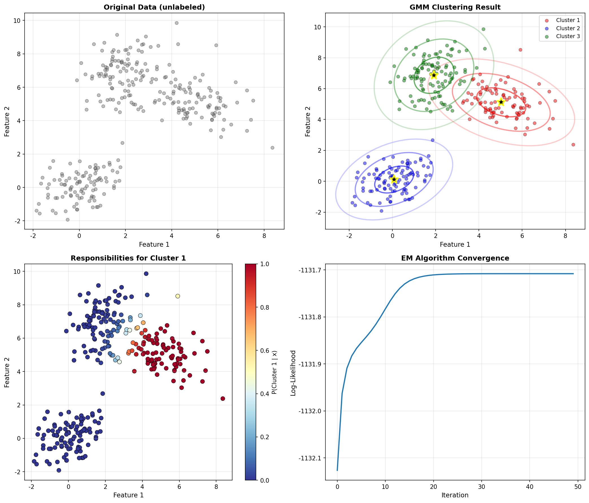
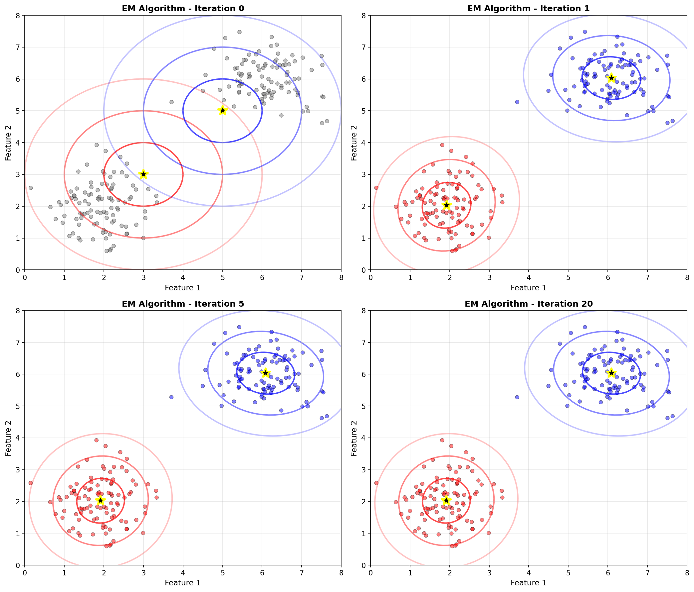

# 機器學習核心筆記

完整的機器學習核心概念筆記，每個章節都配有豐富的視覺化圖片，幫助理解代數和幾何意義。

---

## 📚 章節導覽

### [第一章：回歸分析](01-regression.md)
**主題**：
- Least Squares Error (LSE)
- Regularization (L1/L2)
- Gradient Descent
- Newton's Method
- Bias-Variance Trade-off

**視覺化**：
-  - 最小平方誤差的幾何意義
-  - L2 正規化的效果
-  - 梯度下降路徑
-  - 模型複雜度的影響
-  - 收斂速度比較

---

### [第二章：機率與分佈](02-probability.md)
**主題**：
- Bayes' Theorem
- MLE & MAP
- Gaussian Distribution
- Beta-Binomial Conjugacy
- Gamma-Poisson Conjugacy

**視覺化**：
-  - 高斯分佈的性質
-  - 共軛先驗更新
-  - MLE vs MAP
-  - 所有分佈總覽

---

### [第三章：分類方法](03-classification.md)
**主題**：
- Naive Bayes Classifier
- Sigmoid Function
- Logistic Regression
- Confusion Matrix
- Performance Metrics

**視覺化**：
-  - Sigmoid 函數及其導數
-  - 決策邊界
-  - 分類器比較
-  - 性能評估

---

### [第四章：EM 演算法與聚類](04-em-algorithm.md)
**主題**：
- EM Algorithm 原理
- Gaussian Mixture Model
- E-step & M-step
- K-Means vs GMM

**視覺化**：
-  - 聚類結果
-  - 迭代過程
-  - 演算法概念

---

## 🎨 快速參考


包含所有重要公式的快速參考卡，適合考前複習。

---

## 📖 如何使用這些筆記

### 1. 按順序學習
建議按照章節順序學習：
1. 回歸分析（基礎）
2. 機率與分佈（理論）
3. 分類方法（應用）
4. EM 演算法（進階）

### 2. 配合視覺化
每個概念都有對應的視覺化圖片：
- **代數角度**：查看公式和數學推導
- **幾何角度**：觀察圖片理解直觀意義

### 3. 動手實踐
- 親手推導筆記中的公式
- 運行視覺化腳本觀察參數變化
- 嘗試修改參數看效果

---

## 🔧 生成視覺化

所有圖片都可以重新生成：

```bash
# 生成所有視覺化
uv run python main.py

# 或單獨生成特定章節
uv run python visualizations/regression.py
uv run python visualizations/distributions.py
uv run python visualizations/classification.py
uv run python visualizations/em_algorithm.py
uv run python visualizations/quick_reference.py
```

---

## 💡 學習技巧

### 視覺化記憶法
- 看到公式，想像對應的圖片
- 例如：LSE → 想起誤差線的圖
- 例如：Gradient Descent → 想起等高線上的路徑

### 代數與幾何對照
每個概念都從兩個角度理解：
- **代數**：公式、推導、計算
- **幾何**：形狀、位置、變化

### 重點標記
在學習時標記：
- ⭐ 必考重點
- ⚠️ 容易搞混
- 🔄 需要複習

---

## 📝 重要公式速查

### 回歸
- LSE: $w = (\Phi^T\Phi)^{-1}\Phi^T t$
- Ridge: $w = (\lambda I + \Phi^T\Phi)^{-1}\Phi^T t$
- GD: $w^{(t+1)} = w^{(t)} - \eta \nabla E(w^{(t)})$

### 機率
- Bayes: $P(\theta|D) \propto P(D|\theta)P(\theta)$
- Gaussian: $N(x|\mu,\sigma^2) = \frac{1}{\sqrt{2\pi\sigma^2}}e^{-\frac{(x-\mu)^2}{2\sigma^2}}$

### 分類
- Sigmoid: $\sigma(a) = \frac{1}{1+e^{-a}}$
- Logistic: $P(C_1|x) = \sigma(w^Tx)$

### EM
- E-step: $\gamma(z_{nk}) = \frac{\pi_k N(x_n|\mu_k,\Sigma_k)}{\sum_j \pi_j N(x_n|\mu_j,\Sigma_j)}$
- M-step: $\mu_k = \frac{1}{N_k}\sum_n \gamma(z_{nk})x_n$

---

## 🎯 考試準備

### 考前一週
1. 通讀所有章節
2. 觀察所有視覺化圖片
3. 列出不熟悉的概念

### 考前三天
1. 重點複習標記的部分
2. 親手推導重要公式
3. 對照視覺化加深理解

### 考前一天
1. 快速瀏覽快速參考卡
2. 回憶每個概念的視覺化
3. 複習容易搞混的地方

---

**祝你學習順利！ 📚✨**
